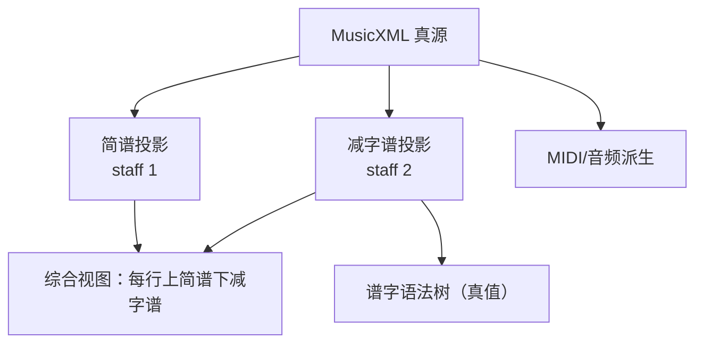

# GuqinJZP-MusicXML Profile v0.2（工作草案）

本文档定义 GuqinAuto 内部使用的 MusicXML Profile：**以单个 MusicXML 文件作为单一真源（Single Source of Truth）**，在不引入“额外 IR 真源”的前提下，支持：

- 节奏/结构（用于回放、导出、校验）
- 简谱（节奏锚点）
- 古琴减字谱（动作锚点：谱字语法树为真值）
- 前端综合视图：**每一行（system）固定“上简谱 / 下减字谱”**，两者不可拆分

v0.2 的核心目标是：**做到“我们定义的减字谱读法语法”能表达的，我们都能在 MusicXML 真源中结构化承载**（包括：简式、撮式/复式、旁注形式、记号、联袂指法；以及对应的符号集合）。

> 重要设计选择（以你最新指示为准）
> - **结构化字段为真值**（对应 `jianzipu` 的语法树结构，可编辑、可校验）
> - `jzp_text` 只是**可重复生成**的派生显示层（缓存/渲染输入），前端不直接编辑

---

## 0. 规范性语言

本文档使用 MUST / SHOULD / MAY 表示强制/建议/可选约束。

---

## 1. 总体思路：用 MusicXML 表达“一条事件流的双投影 + 一棵谱字语法树”

产品交互是：用户编辑的是“音乐事件对象”，但 UI 同时看到两种投影：

- 上：简谱（节奏本位，决定时间线）
- 下：减字谱（动作本位，决定指法/技法/旁注/记号）

MusicXML 很适合做“谱面级真源”，因为小节、时值、连音、反复等结构清晰。减字谱不是 MusicXML 原生语义，因此本 Profile 的关键是：

1) **结构约束**：强制双 staff 同 system 排版，保证“上简谱/下减字谱”不可拆分  
2) **数据约束**：把减字谱谱字解析为语法树，并用 MusicXML 的扩展槽位承载这棵树

---

## 2. 文件级约束（MUST）

### 2.1 MusicXML 版本与类型

- MUST 使用 `score-partwise`
- MUST 标注 `version="4.1"`（MusicXML 4.1）

### 2.2 Part 与 Staff 结构

- MUST 至少包含 1 个 part（GuqinAuto MVP 默认 1 个 guqin part）
- 该 part MUST 使用 2 个 staff（`<attributes><staves>2</staves></attributes>`）
- staff 语义固定：
  - staff 1：简谱层（节奏锚点，定义真时间线）
  - staff 2：减字谱层（动作锚点，承载谱字语法树）

### 2.3 “两层不可拆分”的实现约束

- staff 1 与 staff 2 MUST 同属于一个 system（常规双 staff 渲染行为）
- 若需要稳定的断行（system break），MAY 用 `<print new-system="yes">` 固定（见第 8 节）

---

## 3. 事件模型与对齐（MUST）

### 3.1 事件（Event）定义

本 Profile 定义“事件”是**节奏时间线上的一个时刻片段**，由 staff 1 决定：

- 一个事件对应 staff 1 的一个“时间步”（time step）
- 该时间步 MAY 是单音符、休止符、或一个和弦（多个 `<note>` 组成的 chord cluster）
- 事件以事件级 ID（`eid`）唯一标识

### 3.2 staff 2 与 staff 1 的对齐规则

对每个 measure，staff 2 MUST 与 staff 1 在“事件级别”严格对齐：

- staff 1 的事件序列定义该小节的真节奏结构
- staff 2 MUST 为 staff 1 的事件序列镜像（事件数、事件顺序、事件起止时刻一致）
- staff 2 中每个事件用 **1 个** `<note>` 表示（即使 staff 1 该事件是 chord）

> 这点是为了解决“一个谱字对应多个同时音（撮/和弦）”：
> - staff 1 用 chord 表示多个同时音
> - staff 2 仍用一个谱字事件承载“撮式/复式”的结构化表达

### 3.3 编码方式推荐：voice + backup（SHOULD）

- staff 1：`<voice>1</voice><staff>1</staff>`
- staff 2：`<voice>2</voice><staff>2</staff>`
- 先写完 staff 1，再用 `<backup>` 回到小节起点写 staff 2

---

## 4. 事件身份（Event Identity）

### 4.1 为什么不用 MusicXML `note@id` 作为事件 ID

MusicXML 的 `<note id="...">` 在文档内必须唯一；而一个事件在 staff 1/2 都会出现（甚至 staff 1 还可能是 chord 多 note），因此必须有“事件级”ID。

### 4.2 事件级 ID：`eid`（MUST）

- 每个事件 MUST 有一个 `eid`（字符串）
- `eid` MUST 全曲唯一（推荐 `E000001` 这种稳定 ID）

存放位置（v0.2 约定）：

- staff 2：事件对应的 `<note>` MUST 携带 `GuqinJZP@0.2`，其中 MUST 含 `eid`
- staff 1：属于该事件的所有 `<note>` MUST 携带 `GuqinLink@0.2`，其中 MUST 含 `eid`

---

## 5. 承载位置与 KV 串语法（MUST）

### 5.1 位置选择

推荐把 KV 串写在 `<other-technical>`：

- staff 2（减字谱事件）：  
  `<note> ... <notations><technical><other-technical>GuqinJZP@0.2;...</other-technical></technical></notations> ... </note>`
- staff 1（链接）：  
  `<note> ... <notations><technical><other-technical>GuqinLink@0.2;...</other-technical></technical></notations> ... </note>`

理由：`other-technical` 专为“尚未被 MusicXML 覆盖的演奏法/技术信息”预留，并允许通过 `smufl` 挂接字形。

### 5.2 KV 串语法

KV 文本 MUST 采用如下形式：

`Prefix@version;key=value;key=value;...`

规则：

- MUST 以 `GuqinJZP@0.2;` / `GuqinLink@0.2;` 开头
- 字段以 `;` 分隔
- `key=value` 形式
- value 内 MUST NOT 包含换行与 `;`
- 未识别字段 MUST 报错（不要静默忽略）
- 同一 key MUST NOT 重复出现

---

## 6. GuqinLink@0.2（staff 1 → 事件绑定）

staff 1 的每个 `<note>`（包括 chord 内的每个 `<note>`）MUST 携带：

`GuqinLink@0.2;eid=E000001;...`

字段：

| key | 含义 | 约束 |
|---|---|---|
| `eid` | 事件级 ID | MUST |
| `slot` | chord 内的槽位 | MAY；用于把 staff 1 chord 的某个 note 绑定到 staff 2 的子结构 |

`slot` 约定：

- 对 `form=simple` 且 `xian` 为多弦（如 `历五四`），slot SHOULD 用 `1..N`（与 `xian` 列表顺序一致）
- 对 `form=complex`（撮式/复式），slot SHOULD 使用 `L` / `R`（左子式/右子式）

---

## 7. GuqinJZP@0.2（staff 2 → 谱字语法树真值）

### 7.1 设计目标

`GuqinJZP@0.2` 的字段设计以“谱字语法树”为事实标准（简式/撮式/旁注/记号/联袂）：

- 简式（SimpleForm）
- 复式/撮式（ComplexForm）
- 旁注形式（AsideForm）
- 独体形式：记号（Marker）与联袂指法（BothFinger）

符号全集以本仓库的 token 规范为准：`docs/data/GuqinJZP-JianzipuTokens v0.1.yaml`。

> 备注：token 规范当前只覆盖“可解析语法树”的集合（不含 `按音/泛音/就` 这类未纳入语法树的词）。

### 7.2 公共字段（MUST）

| key | 含义 | 约束 |
|---|---|---|
| `eid` | 事件级 ID | MUST |
| `form` | 谱字形式 | MUST；`simple`/`complex`/`aside`/`marker`/`both` |
| `lex` | 读法体例 | SHOULD；`abbr`/`ortho`；缺省视为 `abbr` |

### 7.3 数字字段约定（统一表示）

为避免 `abbr/ortho` 的文字歧义，数值字段一律用数字枚举：

- `hui`：`1..13` 或 `OUT`
- `fen`：`1..9` 或 `HALF`
- `xian`：`1..7`（弦序）
- 列表值用英文逗号分隔：`xian=5,4`

### 7.4 `form=simple`（简式）

对应 `jianzipu`：`<简式>:== <徽位指法短语>? <特殊>? <弦序指法短语>`

字段：

| key | 含义 | 约束 |
|---|---|---|
| `hui_finger` | 徽位指法 | MAY；来自 `kage.yaml` 的 `徽位指法` |
| `hui` | 徽位 | MAY；`1..13`/`OUT` |
| `fen` | 分位 | MAY；`1..9`/`HALF`（仅当 `hui!=OUT` 时允许） |
| `special` | 特殊指法 | MAY；来自 `特殊指法`（目前 `注/绰`） |
| `xian_finger` | 弦序指法 | MUST；来自 `弦序指法`（如 `勾/剔/抹挑/...`） |
| `xian` | 弦序列表 | MUST；`1..7`，逗号分隔；长度 1 或 2（与 `jianzipu` 的渲染能力对齐） |

一致性约束（MUST）：

- 若 `xian` 长度为 2，则 staff 1 该事件 MUST 是 chord（两个 `<note>`），并且它们的 `GuqinLink.slot` MUST 分别是 `1` 和 `2`
- staff 1 chord 内每个 `<note>` SHOULD 带 `<notations><technical><string>n</string></technical></notations>`，与 `xian` 对齐；不一致 MUST 报错

### 7.5 `form=complex`（复式/撮式：一个谱字对应多个同时音）

对应 `jianzipu`：`<复式>:== <复式指法><复子式><复子式>`

字段：

| key | 含义 | 约束 |
|---|---|---|
| `complex_finger` | 复式指法 | MUST；来自 `复式指法`（如 `撮/掐撮/双弹/拨剌/齐撮`） |
| `l_hui_finger` | 左子式徽位指法 | MAY；来自 `徽位指法` |
| `l_hui` | 左子式徽位 | MAY；`1..13`/`OUT` |
| `l_fen` | 左子式分位 | MAY；`1..9`/`HALF` |
| `l_special` | 左子式特殊指法 | MAY；`注/绰` |
| `l_xian` | 左子式弦序 | MUST；`1..7` |
| `r_hui_finger` | 右子式徽位指法 | MAY；来自 `徽位指法` |
| `r_hui` | 右子式徽位 | MAY；`1..13`/`OUT` |
| `r_fen` | 右子式分位 | MAY；`1..9`/`HALF` |
| `r_special` | 右子式特殊指法 | MAY；`注/绰` |
| `r_xian` | 右子式弦序 | MUST；`1..7` |

一致性约束（MUST）：

- staff 1 该事件 MUST 是 chord 且恰好 2 个 `<note>`
- 两个 `<note>` MUST 分别以 `GuqinLink.slot=L` / `GuqinLink.slot=R` 标注槽位
- staff 1 两个 `<note>` 的 `<string>` SHOULD 分别等于 `l_xian` / `r_xian`；不一致 MUST 报错

> 说明：v0.2 的 complex 固定 2 个子式。将来如果要支持“三声/多子式”，建议通过 `form=both` + 扩展字段实现，而不是“假装支持”。

### 7.6 `form=aside`（旁注形式）

对应 `jianzipu`：`<旁注形式>:== <修饰>? <特殊>? <走位指法短语>`

字段：

| key | 含义 | 约束 |
|---|---|---|
| `modifier` | 修饰词 | MAY；来自 `修饰`（如 `急/缓/紧/慢/引/淌`） |
| `special` | 特殊指法 | MAY；`注/绰` |
| `move_finger` | 走位指法 | MUST；来自 `走位指法`（如 `上/下/进/退/复/吟/猱/...`） |
| `hui` | 徽位 | MAY；`1..13`/`OUT` |
| `fen` | 分位 | MAY；`1..9`/`HALF` |

### 7.7 `form=marker`（记号）

字段：

| key | 含义 | 约束 |
|---|---|---|
| `marker` | 记号 token | MUST；来自 `记号`（如 `少息/入拍/再作/曲终/。/「/...`） |

建议（SHOULD）：

- `form=marker` 通常不应消耗节奏时值；更推荐用 `<direction>` 承载（见第 9 节）

### 7.8 `form=both`（联袂指法）

字段：

| key | 含义 | 约束 |
|---|---|---|
| `both_finger` | 联袂指法 token | MUST；来自 `联袂指法`（`分开/同声/应合/放合/掐撮三声`） |

建议（SHOULD）：

- `form=both` 通常不应消耗节奏时值；更推荐用 `<direction>` 承载（见第 9 节）

---

## 8. `jzp_text`（派生显示层，MAY）

`jzp_text` 是从 `GuqinJZP@0.2` 字段**确定性生成**的显示缓存，用于：

- 在未接入减字谱字体/合字引擎时，先用纯文本显示
- 或作为后续“减字谱渲染链路”的输入（例如生成 SVG）

约束：

- `jzp_text` MAY 不存在（缺省由后端生成）
- 若 `jzp_text` 存在，则 MUST 等于后端按本节生成规则算出的结果；不一致 MUST 报错
- 前端不应直接编辑 `jzp_text`；编辑应落在结构化字段上，由后端重算

生成规则（v0.2，MUST）：

- 生成时必须先把数字字段转为 `jianzipu` 解析器可接受的数字 token：
  - `1..13` → `一..十三`
  - `fen=HALF` → `半`
  - `hui=OUT`：
    - `lex=abbr` 输出 `外`
    - `lex=ortho` 输出 `徽外`
  - `lex=ortho` 时，徽位需附加单位：`{hui}徽`；分位附加单位：`{fen}分`；弦序附加单位：`{xian}弦`
- `lex` 控制“可缩写 token”的归一化：
  - `lex=abbr`：`散音/散` → `散`；`大指/大` → `大`；`食指/食` → `食`；`中指/中` → `中`；`名指/名` → `名`；`跪指/跪` → `跪`
  - `lex=ortho`：反向归一化为 `散音/大指/食指/中指/名指/跪指`

在完成上述归一化后，拼接规则为：

- `form=simple`：`[hui_finger + hui(+fen)] + special + xian_finger + xian_numbers`
- `form=complex`：`complex_finger + left_sub_phrase + right_sub_phrase`，其中子式按与 7.5 同构的拼接（子式弦序不带弦序指法）
- `form=aside`：`modifier + special + move_finger + [hui(+fen)]`
- `form=marker`：`marker`
- `form=both`：`both_finger`

校验（后端 MUST 实现）：

- 生成出的 `jzp_text` MUST 能被本仓库内置的“减字谱读法解析器”接受（否则视为 Profile 规则缺陷或字段组合不合法，必须报错）

---

## 9. 非事件型 token 的 direction 映射（SHOULD）

对“记号/联袂/旁注”这类通常不消耗节奏的 token，推荐使用 `<direction>`（不会影响时间线）：

`<direction><direction-type><words>GuqinTok@0.2;tid=T000001;kind=marker;value=少息;</words></direction-type></direction>`

KV 规则与第 5 节一致，字段建议：

| key | 含义 |
|---|---|
| `tid` | token ID（用于编辑器选择/删除） |
| `kind` | `marker` / `both` / `aside` |
| `value` | token 文本（例如 `分开` / `少息` / `吟`） |
| `anchor_eid` | 绑定到哪个事件（推荐） |
| `pos` | `before` / `after`（相对 anchor 的位置） |

> 说明：v0.2 允许 `form=marker/both/aside` 直接作为事件出现（写在 staff 2 note 上），但更推荐 direction，因为它不破坏节奏镜像约束。

---

## 10. 断行（system break）与版式稳定

- 编辑器需要稳定行布局
- 推荐用 `<print new-system="yes">` 固定 system 断行点（measure 级别）

---

## 11. 校验清单（后端 MUST 实现）

- 每个 measure：staff 2 的事件时间线与 staff 1 完全一致（事件数、起止）
- 每个 staff 2 事件：存在且仅存在一个 `other-technical`，可解析为 `GuqinJZP@0.2`
- 每个 staff 1 note：存在且仅存在一个 `other-technical`，可解析为 `GuqinLink@0.2`（至少包含 `eid`）
- `eid` 全曲唯一；每个 staff 2 事件能在 staff 1 找到对应 `eid`
- chord 事件一致性：
  - `form=simple` 的 `xian` 为多弦时，staff 1 chord note 数量与 slot 标注正确
  - `form=complex` 时，staff 1 必须是 2-note chord 且 `slot=L/R`
- 字段取值合法（token 必须属于 `kage.yaml` 对应集合；数字字段在约束范围内）
- `jzp_text` 若存在，必须与字段生成结果一致，且能被内置解析器接受

---

## 12. 示例文件

位于 `docs/data/examples/`：

- `guqin_jzp_profile_v0.2_minimal.musicxml`：单事件（simple）最小闭环示例
- `guqin_jzp_profile_v0.2_complex_chord.musicxml`：撮式/复式（complex）+ staff 1 chord + slot=L/R
- `guqin_jzp_profile_v0.2_direction_tokens.musicxml`：direction 方式承载 `GuqinTok@0.2`（marker/both）
- `guqin_jzp_profile_v0.2_showcase.musicxml`：综合示例（abbr/ortho、撮式 chord、历双弦 chord、direction token）

配套 token 规范：

- `docs/data/GuqinJZP-JianzipuTokens v0.1.yaml`：减字谱读法层的合法 token 集合（供解析/生成/校验使用）
