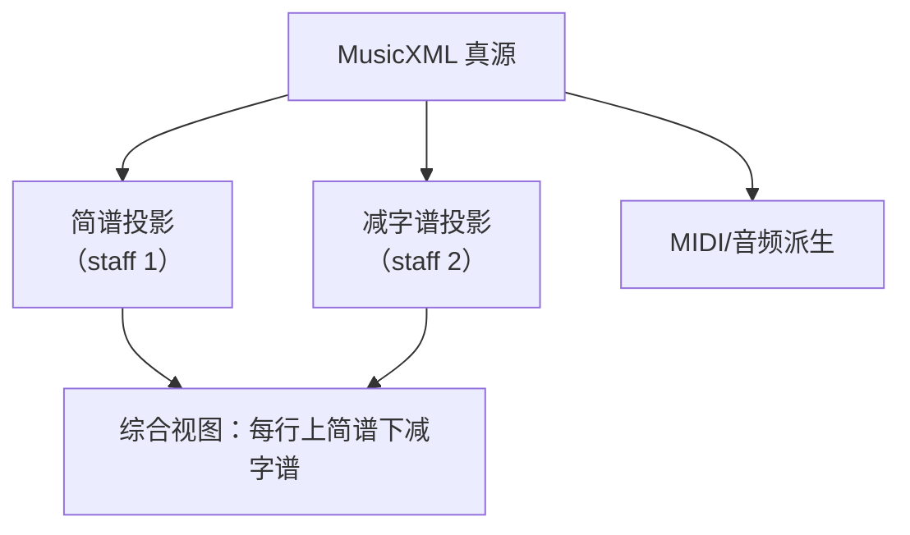

# GuqinJZP-MusicXML Profile v0.1（工作草案，已弃用）

> v0.1 已被 v0.2 取代：`docs/data/GuqinJZP-MusicXML Profile v0.2.md`  
> v0.1 留作历史参考（早期单音字段版）；新实现请以 v0.2 为准。

本文档定义 GuqinAuto 内部使用的 MusicXML Profile：**以单个 MusicXML 文件作为单一真源（Single Source of Truth）**，在不引入“额外 IR 真源”的前提下，支持：

- 节奏/结构（给回放与校验）
- 简谱（节奏锚点）
- 古琴减字谱（动作锚点：散/按/泛、徽位、左右手指法、撮式等）
- 前端综合视图：**每一行（system）固定“上简谱 / 下减字谱”**，两者不可拆分

本 Profile **不追求**外部打谱软件对古琴字段的理解；但要求外部软件在读写时能尽量“保留信息”（不破坏 XML），并且 GuqinAuto 自己能 **严格校验**一致性：宁可“正确地失败”，不要“虚假地成功”。

---

## 0. 规范性语言

本文档使用 MUST / SHOULD / MAY 表示强制/建议/可选约束。

---

## 1. 总体思路：用 MusicXML 表达“一条事件流的双投影”

你要的产品交互是：用户编辑的是一个“音乐事件对象”，但在 UI 上同时看到两种投影：

- 上：简谱（节奏本位）
- 下：减字谱（动作本位）

MusicXML 很适合做“谱面级真源”：节奏与小节结构清晰、可渲染、可导出。问题在于：减字谱不是 MusicXML 原生语义。因此本 Profile 的关键是两点：

1) **结构约束**：在同一份 MusicXML 里强制保持“上简谱/下减字谱”的系统排版结构（两行一组）  
2) **数据约束**：用 MusicXML 的扩展槽位（尤其 `other-technical` / `other-notation` / `other-direction`）承载古琴特有信息，并定义严格的可解析语法

---

## 2. 文件级约束（MUST）

### 2.1 MusicXML 版本与类型

- MUST 使用 `score-partwise`（而非 timewise）
- MUST 标注 `version="4.1"`（本仓库 `references/musicxml/schema/` 为 4.1 DTD/XSD）

### 2.2 Part 与 Staff 结构

- MUST 至少包含 1 个 part（GuqinAuto MVP 默认 1 个 guqin part）
- 该 part MUST 使用 2 个 staff（通过 `<attributes><staves>2</staves></attributes>` 声明）
- staff 语义固定：
  - staff 1：简谱层（节奏锚点）
  - staff 2：减字谱层（动作锚点）

### 2.3 “两层不可拆分”的实现约束

为保证“每一行 system 上下两层一起出现”，本 Profile **推荐**使用“双 staff 同系统排版”的常规做法：

- staff 1 与 staff 2 总是同属于一个 system（由渲染器默认行为实现）
- 若需要稳定的断行（system break），MAY 通过 `<print new-system="yes">` 固定（见第 6 节）

---

## 3. 小节内编码约束（MUST）

### 3.1 两条时间线一致（核心一致性）

对于每个 measure：

- staff 1 的“事件序列”（包含休止/连音/附点等）定义 **该小节的真节奏结构**
- staff 2 必须是 staff 1 的 **一一对齐镜像**（事件数量、事件顺序、事件起止时刻必须一致）

### 3.2 编码方式推荐：voice + backup

为了让两层严格对齐且实现简单，本 Profile 建议采用：

- staff 1：`<voice>1</voice><staff>1</staff>`
- staff 2：`<voice>2</voice><staff>2</staff>`
- 在写完 staff 1 的小节内容后，用一个 `<backup>` 回到小节起点，再写 staff 2

这与“标准五线谱 + TAB”在 MusicXML 中的常见写法一致。

---

## 4. 事件身份（Event Identity）

### 4.1 为什么不能只用 MusicXML 的 `note@id`

MusicXML 的 `<note>` 支持 `id`（DTD 的 `%optional-unique-id`），但 **ID 在文档内必须唯一**。如果我们按两 staff 镜像一条事件流，那么一个音乐事件会对应两个 `<note>`，它们不能共用同一个 `id`。

因此本 Profile 引入“事件级 ID（eid）”，用于把两层的 `<note>` 绑定成“同一个事件”。

### 4.2 事件级 ID（eid）

- 每个音乐事件 MUST 有一个 `eid`（字符串）
- staff 1 与 staff 2 中属于同一事件的 `<note>` MUST 拥有相同的 `eid`
- `eid` MUST 在全曲唯一（建议使用 `E000001` 这类可读且稳定的 ID）

**存放位置（v0.1 约定）**：

- staff 2：`eid` MUST 写入 `GuqinJZP@0.1` KV 串中（见第 5 节）
- staff 1：为避免仅依赖“位置对齐”的脆弱性，staff 1 的 `<note>` MUST 额外携带一个仅用于链接的 KV 串：`GuqinLink@0.1;eid=...;`

> 说明：v0.1 选择“把 eid 放在 other-technical 文本里”是为了不引入自定义 XML 命名空间（更容易被其它工具保留）。后续如果你们确认生态兼容性无压力，可升级为 `guqin:eid` 属性或自定义子元素。

---

## 5. 古琴字段承载（GuqinJZP Block）

### 5.1 位置选择

古琴字段 MUST 写在 staff 2 的 `<note>` 上，推荐位置：

`<note> ... <notations><technical><other-technical>...</other-technical></technical></notations> ... </note>`

依据：`other-technical` 设计目的就是承载“尚未被 MusicXML 覆盖的演奏法/技术信息”，并允许通过 `smufl` 挂接字形（参见 `references/musicxml/schema/note.mod` 中 `other-technical` 的注释）。

### 5.2 KV 串语法（MUST）

`other-technical` 的文本内容 MUST 采用如下形式：

`GuqinJZP@0.1;key=value;key=value;...`

规则：

- MUST 以 `GuqinJZP@0.1;` 开头（用于版本与快速识别）
- 每个字段以 `;` 分隔
- key 与 value 之间用 `=`
- value 内不得包含换行
- 未识别字段 MUST 报错（不要静默忽略）

同时，staff 1 的链接块使用：

`GuqinLink@0.1;eid=E000001;`

### 5.3 v0.1 真值字段集合（MUST）

本 Profile 以“结构化指法字段”为真值，`jzp_text` 仅作为**可重复生成**的显示缓存（详见第 5.4 节）。

| key | 含义 | 约束 |
|---|---|---|
| `eid` | 事件级 ID | MUST，全曲唯一 |
| `sd` | 音别 | MUST，`SAN`/`AN`/`FAN`（散/按/泛） |
| `gs` | 弦序 | MUST，`1`–`7`；多弦用英文逗号分隔，如 `2,3`（v0.1 仅支持单弦，见限制） |
| `rh` | 右手技法 | MUST，枚举（见 5.5） |
| `lf` | 左手指 | `sd!=SAN` 时 MUST；`sd==SAN` 时 MUST NOT 出现；枚举（见 5.6） |
| `hui` | 徽位 | `sd!=SAN` 时 MUST；取值 `1`–`13` 或 `OUT`（徽外） |
| `fen` | 分位 | MAY；取值 `0`–`9`；仅在 `hui!=OUT` 时允许 |
| `la` | 左手动作列表 | MAY；英文逗号分隔；枚举（见 5.7） |
| `co` | 左右配合列表 | MAY；英文逗号分隔；枚举（见 5.8） |
| `jzp_form` | 显示用读法形式 | SHOULD，`abbr` 或 `ortho`；缺省视为 `abbr` |

v0.1 限制（MUST 明确失败）：

- v0.1 仅支持 **单弦单音事件**：`gs` MUST 为单个数字；不支持撮/和弦类“一个谱字对应多个同时音”的结构化表达
- v0.1 不把“记号词/旁注词”编码为 `GuqinJZP@0.1` 的 note（见第 8 节，走 direction/other-direction）

> 说明：之所以把结构化字段作为真值，是为了支持“前端字段级编辑→等价写回真源”，并能做严格校验/代价函数/约束锁定；`jzp_text` 作为缓存仅服务渲染与人类可读性。

### 5.4 `jzp_text`（派生显示层，MAY）

`jzp_text` 是从 5.3 真值字段 **确定性生成** 的文本缓存，用于：

- 前端在未接入专用减字谱字体/合字引擎时，先用纯文本显示
- 或作为对接 `references/jianzipu` 解析/渲染链路的输入（例如生成 SVG）

约束：

- `jzp_text` MAY 不存在（缺省由后端生成）
- 若 `jzp_text` 存在，则 MUST 等于后端按本 Profile 的生成规则算出的结果；不一致 MUST 报错
- 前端不应直接编辑 `jzp_text`；前端编辑应落在结构化字段上，由后端重算并回写

#### 5.4.1 v0.1 生成规则（MUST）

v0.1 的 `jzp_text` 生成仅覆盖“简单形式”的单音事件（不含撮/和弦、记号词、旁注词）：

- 生成结果必须满足 `references/jianzipu/package/jianzipu/README.md` 中的读法语法（`abbr` 或 `ortho`）
- 若字段组合超出 v0.1 可表达范围，必须报错（不要生成一个“看起来像”的安慰剂文本）

生成顺序（以 `jzp_form` 决定 `abbr/ortho`）：

1) 前缀（prefix）
   - 若 `sd=SAN`：前缀为 `散`（`abbr`）或 `散音`（`ortho`）
   - 若 `sd=AN`：前缀为左手指（`lf`）对应汉字：`THUMB/INDEX/MIDDLE/RING/KNEEL` → `大/食/中/名/跪`（`abbr`）或 `大指/食指/中指/名指/跪指`（`ortho`）
   - 若 `sd=FAN`：v0.1 暂不定义泛音的结构化生成（必须报错）；后续版本将补齐（因为不同谱系对泛音读法/符号差异较大）

2) 徽位（position）
   - 若 `sd!=SAN`：
     - `hui=OUT`：`abbr` 输出 `外`，`ortho` 输出 `徽外`
     - `hui=1..13`：
       - `abbr`：输出汉字数字（`一..九,十,十一,十二,十三`）；若 `fen` 存在，再追加 `fen` 的汉字数字（`一..九`，`0` 不输出）
       - `ortho`：输出 `{hui}徽`；若 `fen` 存在且 `fen!=0`，再输出 `{fen}分`

3) 左手动作（optional modifiers）
   - `la` 中以下动作在 v0.1 作为“修饰短语/附加词”串接（按 `la` 列表顺序输出）：
     - `CHUO`：绰
     - `ZHU`：注
     - `YIN`：吟
     - `NAO`：猱
   - 其余 `la` 动作（例如 `ZHUAQI/DAIQI/QIAQI/YAN/...`）在 v0.1 暂不参与 `jzp_text` 自动生成（必须报错），因为它们会改变谱字结构（常见为“独体/旁注/特殊结构”），需要更完整的语法树支持

4) 右手技法 + 弦序（right hand phrase）
   - 右手技法 `rh` 映射为汉字（见 5.5），再追加弦序：
     - `abbr`：弦序为阿拉伯数字（如 `3`）
     - `ortho`：弦序为 `{n}弦`（如 `三弦`）
   - v0.1 仅支持 `gs` 为单弦数字；若 `gs` 为多弦，必须报错

示例（与最小示例一致）：

- 真值：`sd=AN;lf=THUMB;hui=1;fen=6;rh=GOU;gs=3;jzp_form=abbr;`
- 生成：`大一六勾三`

### 5.5 右手技法枚举（`rh`）

v0.1 先覆盖最常用集合（后续可扩展，但扩展必须保持向后兼容）：

- `PI`（擘）、`TUO`（托）、`MO`（抹）、`TIAO`（挑）、`GOU`（勾）、`TI`（剔）、`DA`（打）、`ZHAI`（摘）、`LI`（历）
- `LUN`（轮）、`SUO`（锁）、`GUN`（滚）、`FU`（拂）、`GUNFU`（滚拂）

### 5.6 左手指枚举（`lf`）

- `THUMB`（大）、`INDEX`（食）、`MIDDLE`（中）、`RING`（名）、`KNEEL`（跪）

### 5.7 左手动作枚举（`la`）

v0.1 先覆盖常用动作（来自 `references/jianzipu/draft.txt` 的符号集合）：

- `SHANG`（上）、`XIA`（下）、`JIN`（进）、`TUI`（退）、`FU`（复）
- `CHUO`（绰）、`ZHU`（注）、`YIN`（吟）、`NAO`（猱）
- `ZHUAQI`（抓起）、`DAIQI`（带起）、`QIAQI`（掐起）、`YAN`（罨/掩）
- `BUDONG`（不动）、`TUICHU`（推出）、`JIU`（就）

### 5.8 左右配合枚举（`co`）

- `FENKAI`（分开）、`TONGSHENG`（同声）、`YINGHE`（应合）、`FANGHE`（放合）

- staff 2 的 `<note>` SHOULD 使用 `<notehead>none</notehead>` 隐藏音符头（避免重复视觉噪音）
- staff 2 的谱字展示 SHOULD 先使用 `<lyric>` 作为“最低可用显示层”（后续再接入专用字体/合字渲染）

`<lyric>` 建议：
- `number="1"`：减字谱文本
- `placement="below"`：放在下方

### 5.5 可选：字形挂接（MAY）

如果需要在 MusicXML 层面携带“更细的字形提示”，可以使用 `other-technical@smufl` 或 `other-direction@smufl`。

- `smufl` 语法在 MusicXML DTD 中是 `NMTOKEN`，允许自定义名称
- 你们可以参考 `references/jianzipu/draft.txt` 中已有的 `qin-xxxx` 编码体系，作为内部 glyph 名称来源

---

## 6. 简谱层（staff 1）建议

### 6.1 clef-sign=jianpu（SHOULD）

staff 1 的 `<clef>` SHOULD 使用 `<sign>jianpu</sign>`（参见 `references/musicxml/schema/attributes.mod` 对 clef-sign 的说明）。

注意：不同渲染器对 jianpu 的支持差异较大。为保证“即使渲染器不懂 jianpu 也能显示”，你可以：

- MAY 使用 `<lyric placement="above">` 在音符上方显示简谱数字（作为保底）
- 或 MAY 使用 `<notehead-text>` 显示（更像“数字在符头里”，但与简谱习惯不完全一致）

### 6.2 1=Do 不明确的情况

当导入数据未提供调性（或 1=Do 不明确）时，pitch 可能无法确定。v0.1 建议：

- 仍然 MUST 编码节奏（duration/type/dot 等）
- pitch MAY 暂用占位（例如统一 C4），但 MUST 同时在 staff 1 写入可解析的 jianpu 显示层（例如 lyric 上方的数字与升降记号），并在文件级标记“调性未定”（未来可扩展到 `work`/`identification` 中的自定义字段）

---

## 7. 断行（system break）与版式稳定

编辑器需要“稳定的行布局”，否则用户改一个字段导致全曲换行，会严重影响编辑体验。

v0.1 推荐方案：

- 使用 `<print new-system="yes">` 固定 system 断行点（measure 级别）
- 断行点 SHOULD 只由“显式断行操作”产生，不应由自动排版随意改写

---

## 8. 非音符类“谱字/记号/说明”的映射（MAY）

`references/jianzipu` 中存在“记号词”（如 `少息`/`大息`/`入拍`/`再作`/`曲终` 等），它们更接近 direction / repeat / barline。

v0.1 建议映射优先级：

1) 若 MusicXML 有原生语义（repeat、ending、da capo 等），优先用原生元素
2) 否则用 `<direction><direction-type><words>...</words></direction-type></direction>` 显示
3) 如需结构化，MAY 用 `<other-direction>` 的 KV 串承载（语法与第 5 节一致，prefix 可用 `GuqinDir@0.1;...`）

---

## 9. 最小示例

示例文件：`docs/data/examples/guqin_jzp_profile_v0.1_minimal.musicxml`

该示例演示：

- 1 个 part，2 个 staff
- staff 1 写节奏/pitch + 简谱显示（保底用 lyric above）
- staff 2 用 notehead=none + lyric below 显示减字谱
- staff 2 的 other-technical 携带 `GuqinJZP@0.1` KV（结构化真值字段 + `jzp_form`）
- 使用 `<backup>` 保证两层对齐

---

## 10. 校验清单（后端 MUST 实现）

- 每个 measure：staff 2 的时间线与 staff 1 完全一致（起止与事件数）
- 每个 staff 2 note：存在且仅存在一个 `other-technical`，且能解析为 `GuqinJZP@0.1` KV
- 每个 staff 1 note：存在且仅存在一个 `other-technical`，且能解析为 `GuqinLink@0.1` KV（至少包含 `eid`）
- `eid` 全曲唯一；每个事件能在两层找到对应绑定关系
- 真值字段取值合法（`sd/gs/rh/lf/hui/fen/la/co/jzp_form`）
- `jzp_text` 若存在，必须与真值字段生成结果一致；并且生成结果应能被 `references/jianzipu` 的读法语法接受（否则视为 Profile 规则缺陷/或字段组合不合法）

---

## 11. 前端编辑与“等价修改真源”（实现建议）

这里不规定前端 UI 形态，只规定“编辑操作如何等价落到 MusicXML 真源上”，用于保证一致性。

### 11.1 选中与定位

- 前端选中事件时 SHOULD 以 `eid` 作为唯一键
- `eid` 的来源：
  - staff 2：解析 `GuqinJZP@0.1;eid=...;...`
  - staff 1：解析 `GuqinLink@0.1;eid=...;`

### 11.2 修改简谱字段（节奏/音高）

当用户在 Inspector 修改简谱字段（时值、附点、连音、度数/升降/八度等）时：

- MUST 修改 staff 1 的 MusicXML 原生字段（`duration/type/dot/time-modification/pitch/accidental/tie` 等）
- MUST 同步修改 staff 2 的时间线镜像（至少 `duration/type/dot/time-modification` 必须一致）
- SHOULD 保持 staff 2 的 `jzp_text` 语义不变（除非音高变化导致指法不可用；这种情况必须在后端校验阶段明确报错并要求用户/优化器选择新指法）

### 11.3 修改减字谱字段（指法/技法）

当用户修改减字谱：

- MUST 修改 staff 2 的 `GuqinJZP@0.1` KV（至少 `sd/jzp_form/jzp_text`）
- MAY 同步更新 staff 2 的 `<lyric>` 显示文本（若存在则应保持一致）
- MUST 触发后端校验：保证该指法在当前调弦/音高/节奏约束下可演奏；不满足则拒绝写入

### 11.4 插入/删除事件

插入/删除是最容易造成“真假不同步”的操作，因此 v0.1 推荐强约束：

- 插入一个事件 MUST 同时在 staff 1 与 staff 2 插入（生成新的全局唯一 `eid`）
- 删除一个事件 MUST 同时在 staff 1 与 staff 2 删除（按同一 `eid`）
- 任意时刻若出现 staff 1/2 的 `eid` 集合不一致，必须视为真源损坏并报错
