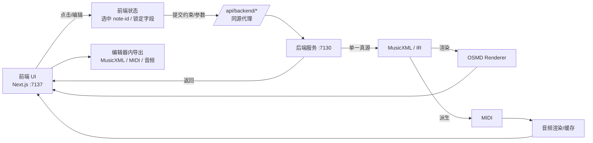

# 前端架构（Next.js）

本文档描述 `frontend/` 的技术栈、路由骨架与数据流约定，便于后续对接后端（`7130`）与谱面渲染（OSMD）。

## 技术栈

- Next.js（App Router）+ TypeScript
- TailwindCSS（本地样式变量，不依赖在线字体/CDN）
- 同源代理：`/api/backend/*`（前端）→ `BACKEND_BASE_URL`（后端）

## 端口与服务

- 前端：`http://localhost:7137`
- 后端：`http://localhost:7130`

## 路由骨架

- `/`：项目列表（占位）
- `/import`：导入与参数（占位）
- `/editor`：编辑器（布局骨架）
- `/settings`：设置（占位）

## 编辑器页面分区（与PRD一致）

编辑器页面目前仅搭了“稳定区块”，方便后续逐块填充：

- 顶部工具栏：`EditorTopBar`（项目名/保存状态/撤销重做/导出/播放控制）
- 左侧结构栏：曲目结构、小节导航、方案 Top-K、锁定统计、局部再优化入口
- 中央谱面区：综合双谱面视图（每行：上简谱 + 下减字谱，未来挂载 OSMD）
- 右侧 Inspector：简谱属性 / 减字属性 / 候选与诊断 / 回放表现 四个页签
- 底部事件条（可选）：连续参数与试听层调参入口

## 数据流与代理约定

后端接口与编辑协议（v0，MVP）：`docs/后端-编辑协议.md`

## 代理实现

- 代理入口：`frontend/src/app/api/backend/[...path]/route.ts`
- 后端地址：`frontend/.env` 中的 `BACKEND_BASE_URL`（默认 `http://127.0.0.1:7130`）

## 后续落点（建议的最小增量）

- 在 `/editor` 中挂载 OSMD：以 MusicXML 为输入，渲染简谱与减字谱两视图
- 抽象 `note-id` 选中与联动高亮：两视图共享身份
- Inspector 的字段编辑 → 走后端校验与“约束下再优化” → 返回新 MusicXML → 局部重绘
